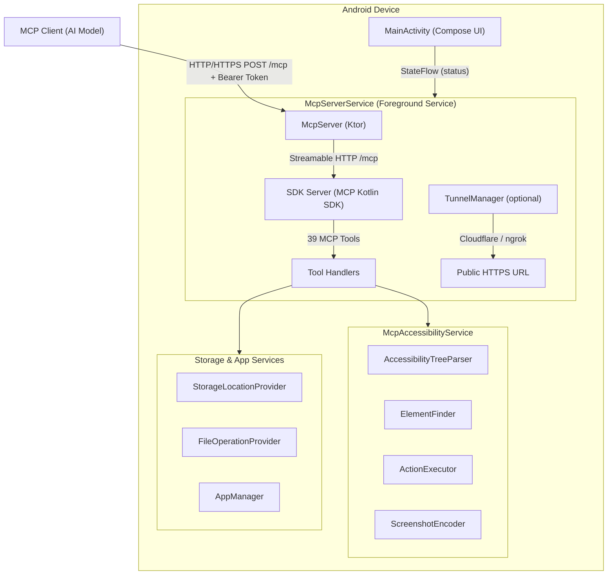

# Android Remote Control MCP

[](https://github.com/danielealbano/android-remote-control-mcp/actions/workflows/ci.yml)
[](https://opensource.org/licenses/MIT)

An Android application that runs as an **MCP (Model Context Protocol) server**, enabling AI models to **fully control an Android device** remotely using accessibility services and screenshot capture.

The app runs directly on your Android device (or emulator) and exposes an HTTP server (with optional HTTPS) implementing the MCP protocol. AI models like Claude can connect to it and interact with any app on the device — reading UI elements, tapping buttons, typing text, swiping, capturing screenshots, managing files, launching apps, and more.

---

## Features

### MCP Server
- HTTP server running directly on Android (Ktor + Netty), with optional HTTPS
- Streamable HTTP transport at `/mcp` (MCP specification compliant, JSON-only, no SSE)
- Bearer token authentication (global, all requests)
- Auto-generated self-signed TLS certificates (or custom certificate upload)
- Configurable binding: localhost (127.0.0.1) or network (0.0.0.0)
- Auto-start on boot
- Remote access tunnels via Cloudflare Quick Tunnels or ngrok (public HTTPS URL)

### 39 MCP Tools across 9 Categories

All tool names use the `android_` prefix by default (e.g., `android_tap`). When a device slug is configured (e.g., `pixel7`), the prefix becomes `android_pixel7_` (e.g., `android_pixel7_tap`). See [docs/MCP_TOOLS.md](docs/MCP_TOOLS.md) for the full naming convention.

| Category | Tools | Description |
|----------|-------|-------------|
| **Screen Introspection** (1) | `android_get_screen_state` | Consolidated screen state: app info, screen dimensions, filtered UI element list (TSV), optional low-res screenshot |
| **System Actions** (6) | `android_press_back`, `android_press_home`, `android_press_recents`, `android_open_notifications`, `android_open_quick_settings`, `android_get_device_logs` | Global device actions and log retrieval |
| **Touch Actions** (5) | `android_tap`, `android_long_press`, `android_double_tap`, `android_swipe`, `android_scroll` | Coordinate-based touch interactions |
| **Gestures** (2) | `android_pinch`, `android_custom_gesture` | Multi-touch and complex gestures |
| **Element Actions** (4) | `android_find_elements`, `android_click_element`, `android_long_click_element`, `android_scroll_to_element` | Accessibility node-based interactions |
| **Text Input** (5) | `android_type_append_text`, `android_type_insert_text`, `android_type_replace_text`, `android_type_clear_text`, `android_press_key` | Natural text input via InputConnection and key events |
| **Utilities** (5) | `android_get_clipboard`, `android_set_clipboard`, `android_wait_for_element`, `android_wait_for_idle`, `android_get_element_details` | Helper tools for automation and element inspection |
| **File Operations** (8) | `android_list_storage_locations`, `android_list_files`, `android_read_file`, `android_write_file`, `android_append_file`, `android_file_replace`, `android_download_from_url`, `android_delete_file` | File system access via Storage Access Framework (SAF) |
| **App Management** (3) | `android_open_app`, `android_list_apps`, `android_close_app` | Launch, list, and close applications |

See [docs/MCP_TOOLS.md](docs/MCP_TOOLS.md) for full tool documentation with input/output schemas and examples.

### Android App
- Material Design 3 configuration UI with dark mode
- Server status monitoring (running/stopped)
- Connection info display (IP, port, token, tunnel URL)
- Permission management (Accessibility, Notifications)
- Remote access tunnel configuration (Cloudflare / ngrok)
- Storage location management (SAF authorization for file tools)
- Server log viewer (MCP tool calls, tunnel events)

---

## Requirements

### For Building
- **JDK 17** (e.g., [Eclipse Temurin](https://adoptium.net/))
- **Android SDK** with API 34 (Android 14)
- **Gradle** 8.x (wrapper included, no global install needed)

### For Running
- Android device or emulator running **Android 13+** (API 33+), targeting **Android 14** (API 34)
- **adb** (Android Debug Bridge) for device/emulator management

### For E2E Tests
- **Docker** (for `budtmo/docker-android-x86` emulator image)

Check all dependencies:
```bash
make check-deps
```

---

## Quick Start

### 1. Build the App

```bash
git clone https://github.com/danielealbano/android-remote-control-mcp.git
cd android-remote-control-mcp
make build
```

### 2. Install on Device/Emulator

```bash
# Start an emulator (if no device connected)
make setup-emulator
make start-emulator

# Install the debug APK
make install
```

### 3. Configure Permissions

1. **Enable Accessibility Service**: Open the app, tap "Enable Accessibility Service", and toggle it on in Android Settings. This also enables screenshot capture via the `takeScreenshot()` API (Android 11+).

### 4. Start the MCP Server

Tap the "Start Server" button in the app. The server starts on `http://127.0.0.1:8080` by default (HTTPS is disabled by default).

### 5. Connect from Host Machine

Set up port forwarding (if server is bound to localhost):
```bash
make forward-port
```

Test the connection:
```bash
curl -X POST http://localhost:8080/mcp \
  -H "Authorization: Bearer YOUR_TOKEN" \
  -H "Content-Type: application/json" \
  -d '{"jsonrpc":"2.0","id":1,"method":"ping"}'
```

### 6. Make MCP Tool Calls

All requests are sent as JSON-RPC 2.0 via `POST /mcp` (Streamable HTTP transport):

```bash
# List available tools
curl -X POST http://localhost:8080/mcp \
  -H "Authorization: Bearer YOUR_TOKEN" \
  -H "Content-Type: application/json" \
  -d '{"jsonrpc":"2.0","id":1,"method":"tools/list"}'

# Get the current screen state (UI elements + optional screenshot)
curl -X POST http://localhost:8080/mcp \
  -H "Authorization: Bearer YOUR_TOKEN" \
  -H "Content-Type: application/json" \
  -d '{"jsonrpc":"2.0","id":2,"method":"tools/call","params":{"name":"android_get_screen_state","arguments":{}}}'

# Tap at coordinates
curl -X POST http://localhost:8080/mcp \
  -H "Authorization: Bearer YOUR_TOKEN" \
  -H "Content-Type: application/json" \
  -d '{"jsonrpc":"2.0","id":3,"method":"tools/call","params":{"name":"android_tap","arguments":{"x":540,"y":1200}}}'
```

The bearer token is displayed in the app's connection info section. You can copy it directly from the app.

---

## Building

### Debug Build

```bash
make build
# APK: app/build/outputs/apk/debug/app-debug.apk
```

### Release Build

```bash
make build-release
# APK: app/build/outputs/apk/release/app-release.apk
```

For signed release builds, create `keystore.properties` in the project root:
```properties
storeFile=path/to/your.keystore
storePassword=your_store_password
keyAlias=your_key_alias
keyPassword=your_key_password
```

### Clean Build

```bash
make clean
```

---

## Testing

### Unit Tests

```bash
make test-unit
```

Runs JUnit 5 unit tests with MockK for mocking. Tests cover accessibility tree parsing, element finding, screenshot encoding, settings repository, network utilities, and all 39 MCP tool handlers.

### Integration Tests

```bash
make test-integration
```

Runs JVM-based integration tests using Ktor `testApplication` (no device or emulator required). Tests the full HTTP stack: authentication, JSON-RPC protocol, tool dispatch for all 9 tool categories, and error handling.

> **Note**: Some integration tests (e.g., `NgrokTunnelIntegrationTest`) require environment variables. Copy `.env.example` to `.env` and fill in the required values. The Makefile sources `.env` automatically.

### E2E Tests

```bash
make test-e2e
```

Requires Docker. Starts a full Android emulator inside Docker, installs the app, and performs real MCP tool calls. Includes:
- **Calculator test**: 7 + 3 = 10 via MCP tools (verifies full stack)
- **Screenshot test**: Capture with different quality settings
- **Error handling test**: Authentication, unknown tools, invalid params

### All Tests

```bash
make test
```

### Code Coverage

```bash
make coverage
```

Generates a Jacoco HTML report at `app/build/reports/jacoco/jacocoTestReport/html/index.html`. Minimum coverage target: 80%.

---

## Architecture

The application is a **service-based Android app** with three main components:

1. **McpAccessibilityService** - UI introspection, action execution, and screenshot capture via Android Accessibility APIs (`takeScreenshot()` on Android 11+)
2. **McpServerService** - Foreground service running the Ktor HTTP/HTTPS server
3. **MainActivity** - Jetpack Compose UI for configuration and control



See [docs/ARCHITECTURE.md](docs/ARCHITECTURE.md) for detailed architecture documentation.

---

## Configuration

### Server Settings (via App UI)

| Setting | Default | Description |
|---------|---------|-------------|
| Port | `8080` | HTTP/HTTPS server port |
| Binding Address | `127.0.0.1` | `127.0.0.1` (localhost, use with adb port forwarding) or `0.0.0.0` (network, all interfaces) |
| Bearer Token | Auto-generated UUID | Authentication token for MCP requests |
| HTTPS | Disabled | Enable HTTPS with auto-generated self-signed certificate (configurable hostname) or upload custom .p12/.pfx |
| Auto-start on Boot | Disabled | Start MCP server automatically when device boots |
| Device Slug | Empty | Optional device identifier for tool name prefix (e.g., `pixel7` makes tools `android_pixel7_tap`) |
| Remote Access Tunnel | Disabled | Expose server via public HTTPS URL (Cloudflare Quick Tunnels or ngrok) |
| File Size Limit | 50 MB | Maximum file size for file operations (range 1-500 MB) |
| Allow HTTP Downloads | Disabled | Allow non-HTTPS downloads via `android_download_from_url` |
| Download Timeout | 60 seconds | Timeout for file downloads (range 10-300 seconds) |

### Using with adb Port Forwarding (Recommended)

When the server is bound to `127.0.0.1` (default, most secure):

```bash
# Forward device port to host
adb forward tcp:8080 tcp:8080

# Test connection from host
curl -X POST http://localhost:8080/mcp \
  -H "Authorization: Bearer YOUR_TOKEN" \
  -H "Content-Type: application/json" \
  -d '{"jsonrpc":"2.0","id":1,"method":"ping"}'
```

### Using over Network

When the server is bound to `0.0.0.0`:

1. Find the device's IP address (shown in the app's connection info)
2. Connect directly via `POST http://DEVICE_IP:8080/mcp` with bearer token

**Warning**: Binding to `0.0.0.0` exposes the server to all devices on the same network. Only use on trusted private networks.

### Using Remote Access Tunnels

For connecting from outside the local network without port forwarding:

1. **Cloudflare Quick Tunnels** (default, no account required): Creates a temporary tunnel with a random `*.trycloudflare.com` HTTPS URL.
2. **ngrok** (account required): Supports optional custom domains. Requires an ngrok authtoken (free tier available). Only available on ARM64 devices.

Enable the tunnel in the app's "Remote Access" section. The public URL is displayed in the connection info and server logs.

---

## Security

### HTTPS (Optional, Disabled by Default)
- HTTPS can be enabled in the app settings for encrypted TLS communication
- When enabled, uses auto-generated self-signed certificates (or upload your own CA-signed certificate)
- Certificate is stored in app-private storage
- Server defaults to HTTP; enable HTTPS when operating on untrusted networks

### Bearer Token Authentication
- Every MCP request requires `Authorization: Bearer <token>` header
- Token is auto-generated on first launch (UUID)
- Token can be viewed, copied, and regenerated in the app
- Constant-time comparison prevents timing attacks

### Binding Address
- **Default `127.0.0.1`**: Only accessible via adb port forwarding (most secure)
- **Optional `0.0.0.0`**: Accessible over network (use only on trusted networks)
- Security warning dialog displayed when switching to network mode

### Permissions
- **Accessibility Service**: Required for UI introspection, actions, and screenshots (user must enable manually)
- **Internet**: For running the HTTP/HTTPS server
- **Foreground Service**: For keeping services alive in background
- **Receive Boot Completed**: For auto-start on boot
- **Query All Packages**: For listing installed applications (`android_list_apps`)
- **Kill Background Processes**: For closing background applications (`android_close_app`)
- **Storage Access Framework**: Per-location authorization via system file picker (for file tools)
- No root access required

---

## Linting

```bash
# Check for issues
make lint

# Auto-fix issues
make lint-fix
```

Uses ktlint for code style and detekt for static analysis.

---

## Contributing

1. Fork the repository
2. Create a feature branch: `git checkout -b feat/your-feature`
3. Make your changes following the project conventions (see [docs/PROJECT.md](docs/PROJECT.md))
4. Ensure all checks pass: `make lint && make test-unit && make build`
5. Commit with descriptive messages (e.g., `feat: add new MCP tool for ...`)
6. Open a pull request

### Development Conventions

- **Language**: Kotlin with Android (Jetpack Compose, Ktor)
- **Architecture**: Service-based with SOLID principles
- **Testing**: JUnit 5 + MockK (unit), Ktor testApplication (JVM integration), Testcontainers (E2E)
- **Linting**: ktlint + detekt
- **DI**: Hilt (Dagger-based)

See [docs/PROJECT.md](docs/PROJECT.md) for the complete project bible.

---

## License

This project is licensed under the MIT License. See [LICENSE](LICENSE) for details.
