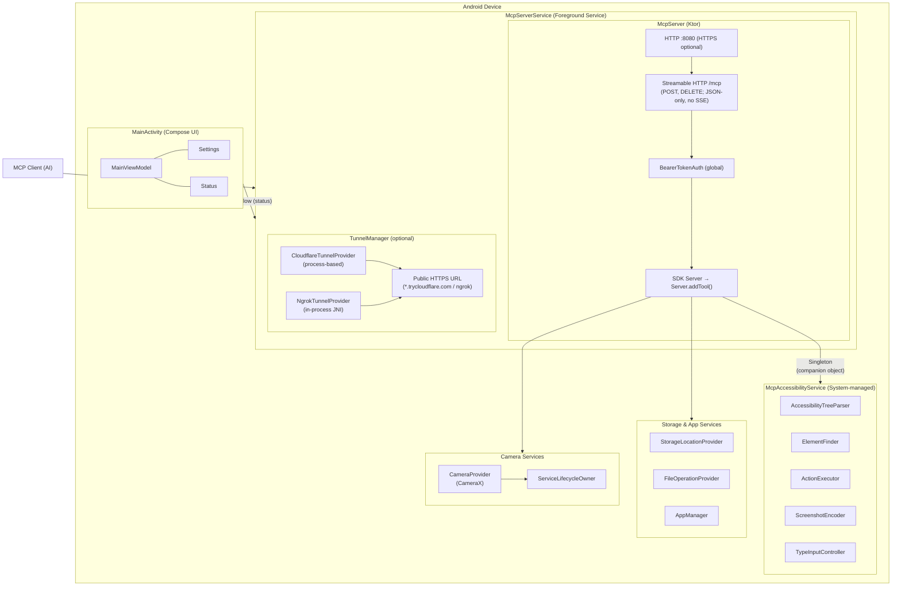
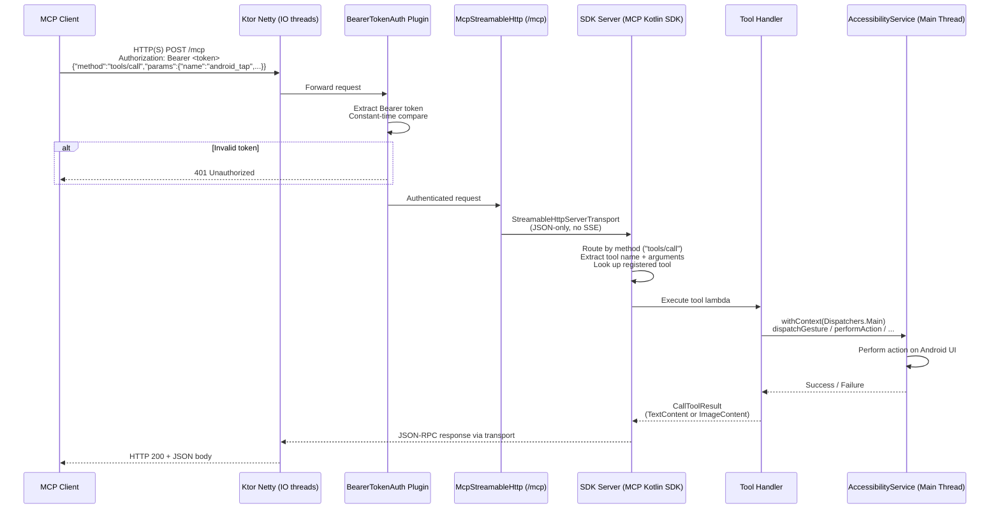
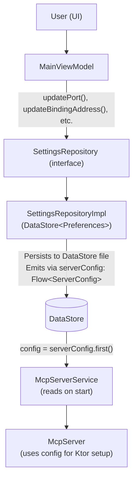
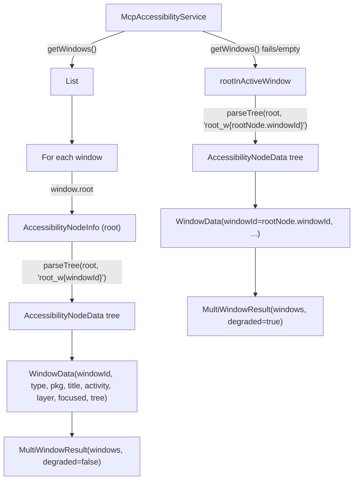

# Application Architecture

This document describes the runtime architecture of the Android Remote Control MCP application.
It focuses on **how** components interact at runtime rather than **what** they are
(for design decisions and specifications, see [PROJECT.md](PROJECT.md)).

---

## Component Diagram

---

## Service Lifecycle

### Startup Sequence

1. **User opens app** -> `MainActivity.onCreate()` renders Compose UI
2. **User enables accessibility** -> System starts `McpAccessibilityService`
   - `onServiceConnected()` stores `instance` in companion object
   - Service remains running until disabled in Settings
3. **User taps "Start Server"** -> `MainViewModel.startServer()` called
   - Sends `ACTION_START` intent to `McpServerService`
   - `McpServerService.onStartCommand()`:
     a. Calls `startForeground()` with notification (within 5 seconds)
     b. Reads `ServerConfig` from `SettingsRepository`
     c. Gets/creates SSL keystore from `CertificateManager` (only if HTTPS enabled)
     d. Creates `McpServer` with config, keystore, and SDK `Server` (MCP Kotlin SDK)
     e. Starts Ktor server (HTTP by default, HTTPS if enabled)
     f. Updates `ServerStatus.Running` via companion-level StateFlow
     g. If tunnel enabled: starts `TunnelManager` (connects to Cloudflare or ngrok)
     h. Tunnel status and URL logged to UI via `serverLogEvents` SharedFlow

### Shutdown Sequence

1. **User taps "Stop Server"** -> `MainViewModel.stopServer()` called
   - Sends `ACTION_STOP` intent to `McpServerService`
   - `McpServerService.onDestroy()`:
     a. Updates `ServerStatus.Stopping` via companion-level StateFlow
     b. Stops tunnel (with 3s ANR-safe timeout) — tunnel stops BEFORE server
     c. Stops Ktor server gracefully (1s grace + 5s timeout)
     d. Cancels coroutine scope
     e. Clears singleton instance
     f. Updates `ServerStatus.Stopped` via companion-level StateFlow

### Auto-Start on Boot

1. Device boots -> Android delivers `BOOT_COMPLETED` broadcast
2. `BootCompletedReceiver.onReceive()`:
   a. Reads auto-start setting from `SettingsRepository`
   b. If enabled: starts `McpServerService` via `startForegroundService()`
   c. If disabled: does nothing

---

## Threading Model

### Thread Assignments

| Thread/Dispatcher     | Responsibilities                                        |
|-----------------------|---------------------------------------------------------|
| Main Thread           | Compose UI, Activity lifecycle, AccessibilityService    |
|                       | node operations, `onAccessibilityEvent()`               |
| Dispatchers.IO        | DataStore reads/writes, Ktor server startup, network I/O, file operations (SAF) |
| Dispatchers.Default   | Screenshot JPEG encoding, accessibility tree parsing    |
| Ktor Netty threads    | HTTP request handling (NIO event loop)                  |

### Coroutine Scopes

| Component             | Scope                      | Lifecycle                    |
|-----------------------|---------------------------|------------------------------|
| MainViewModel         | `viewModelScope`          | ViewModel lifecycle          |
| McpServerService      | Custom `CoroutineScope`   | Service onCreate to onDestroy|
| McpAccessibilityService| Custom `CoroutineScope`  | Service lifecycle            |

### Thread Safety

- SDK `Server` tool registry: thread-safe (managed by MCP SDK)
- `McpAccessibilityService.instance`: `@Volatile` singleton
- `McpServer.running`: `AtomicBoolean`
- Accessibility node access: Must be on main thread (Android requirement)

---

## Data Flow: MCP Request

---

## Security Model

### HTTPS (Optional Transport Security)

- When HTTPS is enabled, all traffic encrypted with TLS 1.2+
- Self-signed or custom certificate (when HTTPS is enabled)
- HTTP by default; HTTPS available as optional toggle in settings
- Certificate stored in app-private directory

### Bearer Token (Authentication)

- Every request requires `Authorization: Bearer <token>` header (global Application-level plugin)
- Token validated with constant-time comparison (prevents timing attacks)
- Token auto-generated (UUID) on first launch, user can regenerate
- Token stored in DataStore (app-private)

### Network Binding (Exposure Control)

- Default: `127.0.0.1` (localhost only, requires `adb forward`)
- Optional: `0.0.0.0` (all interfaces, with security warning)
- No external firewall; relies on Android's app sandbox and bearer token

---

## Configuration Flow

Settings are read at server start time. Changing settings while the server is
running requires a restart (UI disables config editing when server is running).

---

## Permission Model

| Permission               | Type          | How Granted                        | Required For              |
|--------------------------|---------------|------------------------------------|---------------------------|
| INTERNET                 | Normal        | Auto-granted (manifest)            | HTTP server               |
| FOREGROUND_SERVICE       | Normal        | Auto-granted (manifest)            | Foreground services       |
| RECEIVE_BOOT_COMPLETED   | Normal        | Auto-granted (manifest)            | Auto-start on boot        |
| QUERY_ALL_PACKAGES       | Normal        | Auto-granted (manifest)            | Listing installed apps    |
| KILL_BACKGROUND_PROCESSES| Normal        | Auto-granted (manifest)            | Closing background apps   |
| POST_NOTIFICATIONS       | Runtime (13+) | System dialog                      | Foreground notifications  |
| Accessibility Service    | Special       | User enables in Settings           | UI introspection/actions  |
| AccessibilityService takeScreenshot | Special | User enables in Settings | Screenshots (Android 11+) |
| CAMERA                   | Runtime       | System dialog                      | Camera photo/video tools  |
| RECORD_AUDIO             | Runtime       | System dialog                      | Video recording with audio|
| SAF tree URI permissions | Special       | User grants via system file picker | File operations per storage location |

---

## Multi-Window Accessibility Architecture

The application uses Android's multi-window accessibility API (`AccessibilityService.getWindows()`) to enumerate and introspect **all** interactive windows on screen, not just the foreground app. This enables the MCP client to see and interact with system dialogs, permission popups, IME keyboards, and accessibility overlays.

### Window Discovery Flow

### Key Data Types

| Type | Description |
|------|-------------|
| `WindowData` | Window metadata (ID from `AccessibilityWindowInfo.getId()`, type, package, title, activity, layer, focused) plus the parsed `AccessibilityNodeData` tree |
| `MultiWindowResult` | List of `WindowData` plus a `degraded` flag indicating fallback to single-window mode |

### Node ID Uniqueness

Node IDs are deterministic hashes generated from the node's properties and parent chain. The `rootParentId` passed to `parseTree()` (e.g., `"root_w42"`) is the root of the hash chain, so identical nodes in different windows produce different IDs. The window ID is not appended as a visible suffix — it influences the hash internally. Example: `node_a1b2` (not `node_a1b2_w42`).

### Degraded Mode

When `getWindows()` returns empty or fails, the system falls back to `rootInActiveWindow` (single-window mode). In this mode:
- A single `WindowData` is created with `windowId` set to `rootNode.windowId` (the system-assigned window ID of the active window)
- The window type is detected via `rootNode.window?.type` when available, defaulting to `APPLICATION` otherwise
- The `MultiWindowResult.degraded` flag is set to `true`
- The TSV output includes a `note:DEGRADED` line to inform the MCP client
- Action execution falls back to `getRootNode()` for node resolution

### Cross-Window Action Execution

When executing a node-based action (click, long-click, scroll-to-element):
1. The caller provides the `List<WindowData>` from the multi-window snapshot, each containing a `windowId` (from `AccessibilityWindowInfo.getId()`)
2. `performNodeAction()` calls `getAccessibilityWindows()` to get the live window list
3. For each `WindowData`, find the matching live `AccessibilityWindowInfo` by `getId()`
4. Get the window's root `AccessibilityNodeInfo`
5. Walk the live tree in parallel with the parsed tree to find the target node by matching the deterministic node ID
6. Perform the accessibility action on the live node

### Required Configuration

The accessibility service XML config (`accessibility_service_config.xml`) must include `FLAG_RETRIEVE_INTERACTIVE_WINDOWS` in the `accessibilityFlags` attribute for `getWindows()` to return results.

---

**End of ARCHITECTURE.md**
